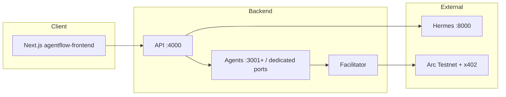

# AgentFlow

**Monorepo:** [github.com/Snehal707/agentflow](https://github.com/Snehal707/agentflow) — Arc Testnet **backend** (`server.ts`, agents, x402) plus **Next.js 14** UI in [`agentflow-frontend/`](agentflow-frontend/).

AgentFlow is a demo **AI agent economy** on **Arc Testnet**, with **Circle x402** micropayments, **Hermes** for chat/orchestration, and **Circle developer-controlled wallets** + Gateway where configured.

## Quick start

1. **Prerequisites:** Node **20+**, npm **8+**, `CLOUDSMITH_TOKEN` for `@circlefin/*` (see [.npmrc](.npmrc)).
2. **Install (repo root):** copy [.env.example](.env.example) → `.env`, then `npm run setup` (or load `CLOUDSMITH_TOKEN` and `npm install`).
3. **Frontend env:** copy `agentflow-frontend/.env.local.example` → `agentflow-frontend/.env.local` and set `NEXT_PUBLIC_BACKEND_URL=http://localhost:4000`.
4. **Full stack (recommended):** from the repo root:

   ```bash
   npm run dev:stack
   ```

   This starts the **public API** (default **:4000**), **Hermes** (**:8000**), **facilitator** (see `FACILITATOR_PORT`, often **:3010**), **dedicated agents** (swap, vault, bridge, schedule, split, research, …), and the **Next.js** app on **:3005** when a production build exists (otherwise `next dev` on **:3005**).  
   **Health checks:** `http://localhost:4000/health`, `http://localhost:3005/api/health`, `http://localhost:8000/health`.

5. **Frontend only (hot reload):** `npm run dev:frontend:hot` from root, or `cd agentflow-frontend && npm run dev`.

On **Windows PowerShell**, chain commands with `;` instead of `&&` if your shell rejects `&&`.

## Project structure

```text
agentflow/
├── server.ts                 # Public API gateway
├── agentflow-frontend/       # Next.js 14 app (chat, pay, portfolio, …)
├── agents/                   # x402 agent microservices (swap, vault, bridge, …)
├── facilitator/              # x402 facilitator
├── lib/                      # Shared backend helpers
├── scripts/                  # setup, deploy helpers, stack cleanup
├── contracts/                # Solidity (Hardhat)
├── foundry/                  # Foundry layout (install forge libs locally)
├── crons/                    # Optional workers
├── docs/                     # Extra deployment / ops notes
├── package.json              # Root scripts (dev:stack, agents, …)
└── tsconfig.json             # Backend TypeScript project
```

## Architecture (high level)



## Environment

See [.env.example](.env.example) for the full list. Commonly needed:

- **Wallet / chain:** `PRIVATE_KEY` or deployer keys as documented in `.env.example`
- **Registry:** `CLOUDSMITH_TOKEN`
- **Hermes:** `HERMES_API_KEY`, `HERMES_BASE_URL`, `HERMES_MODEL`
- **Circle DCW:** `CIRCLE_API_KEY`, `CIRCLE_ENTITY_SECRET`, optional `CIRCLE_WALLET_SET_ID` — `npm run script:setup-circle` can bootstrap some of this

## Running pieces separately

- **API only (agents external):** `npx cross-env EMBEDDED_AGENT_SERVERS=false tsx server.ts` (or `npm run start:api` for production-style).
- **Individual agents:** `npm run dev:swap`, `npm run dev:vault`, `npm run dev:bridge`, etc.
- **Stack cleanup (Windows):** `node scripts/stack-cleanup.js` frees ports before a clean restart.

Embedded vs standalone facilitator/agent ports are described in comments inside `server.ts` and your `.env`; prefer **`FACILITATOR_PORT=3010`** locally to avoid clashing with other tools on **:3000**.

## Production builds

- **Next.js:** `npm run build --prefix agentflow-frontend` then `npm run start:3005 --prefix agentflow-frontend` (or root `npm run dev:frontend` for stable mode when `.next` exists).
- **Deploy:** [DEPLOY.md](DEPLOY.md) (Railway / registry), [PHASE_D_VERCEL.md](PHASE_D_VERCEL.md) (Vercel **Root Directory:** `agentflow-frontend`).

## Arc Testnet

- **USDC as gas** · **Chain ID:** `5042002` · **RPC:** `https://rpc.testnet.arc.network` · **Explorer:** https://testnet.arcscan.app

## Orchestrator CLI (optional)

Legacy three-agent research pipeline driver:

```bash
npm run dev:orchestrator -- "Research topic here"
```

## A2A proof script (optional)

```bash
npm run proof:a2a
```

If the stack is already up: `PROOF_A2A_SKIP_STACK=1 npm run proof:a2a` (PowerShell: `$env:PROOF_A2A_SKIP_STACK="1"`).

## Notes

- **Gasless agent steps** use x402 batching; on-chain activity is mainly deposits/settlements as configured.
- **Stale Node processes** on `4000` / agent ports cause confusing failures; clean restart after changing `server.ts` or agents.
