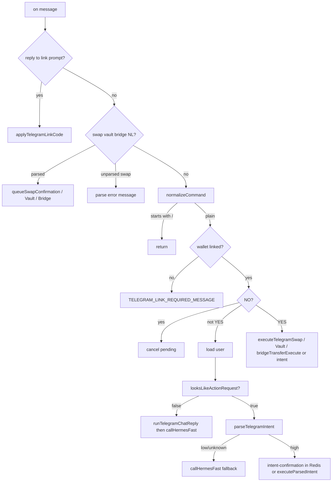

# Telegram support report (read-only)

**Scope:** [`.cursor/rules/agentflow-v3.mdc`](../.cursor/rules/agentflow-v3.mdc) describes the overall product (many agents: swap, vault, bridge, research, etc.) but does **not** define Telegram. **What Telegram actually supports** is whatever is implemented in [`lib/telegram-bot.ts`](../lib/telegram-bot.ts) (plus `setMyCommands` subset).

There are **no** `bot.onText` patterns for the standalone HTTP agents (research, analyst, writer, invoice, etc.). Natural-language “chat” is **Hermes** via `callHermesFast`, not those agent servers.

---

## 1. Slash / handler inventory

| Mechanism | Regex / event | Lines |
|-----------|-----------------|-------|
| `bot.onText` | `^/start(?:@\w+)?(?:\s+(.+))?` | 834-922 |
| `bot.onText` | `^/help(?:@\w+)?` | 924-950 |
| `bot.onText` | `^/link(?:@\w+)?(?:\s+(.+))?` | 952-960 |
| `bot.onText` | `^/unlink(?:@\w+)?` | 962-975 |
| `bot.onText` | `^/balance(?:@\w+)?` | 977-1000 |
| `bot.onText` | `^/portfolio(?:@\w+)?` | 1002-1015 |
| `bot.onText` | `^/swap...` (AMOUNT FROM TO) | 1017-1033 |
| `bot.onText` | `^/vault... usyc (deposit\|withdraw)` | 1035-1051 |
| `bot.onText` | `^/vault... (deposit\|withdraw)` (non-usyc) | 1053-1068 |
| `bot.onText` | `^/bridge...` (AMOUNT CHAIN) | 1070-1090 |
| `bot.on('message')` | catch-all (link reply, NL actions, YES/NO, chat) | 1092-1375 |

**`bot.setMyCommands`** (Telegram command menu) only registers: `start`, `link`, `help`, `balance`, `portfolio`, `unlink` — **not** `swap`, `vault`, `bridge` (lines 1377-1385 in `lib/telegram-bot.ts`).

**Note:** There is no `bot.command(...)` API in this file; only `onText` and `on('message')`.

---

## 2. Agent capabilities exposed on Telegram

From imports and call graph in [`lib/telegram-bot.ts`](../lib/telegram-bot.ts):

- **Swap:** `simulateSwapExecution` / `executeTelegramSwap` — [`lib/runners/telegramSwap`](../lib/runners/telegramSwap) (via imports at 19-22).
- **Vault (5% + USYC):** `simulateTelegramVault` / `executeTelegramVault`, `simulateTelegramUsyc` (imports 25-29; USYC also `checkEntitlement` 23, 523-525).
- **Bridge (CCTP):** `simulateBridgeTransfer`, `bridgeTransferExecute`, `formatBridgeSimulationForTelegram` from [`agents/bridge/bridgeKit.ts`](../agents/bridge/bridgeKit.ts) (31-35).
- **Portfolio snapshot:** `buildPortfolioSnapshot` from [`agents/portfolio/portfolio.ts`](../agents/portfolio/portfolio.ts) (37).
- **Balances:** on-chain USDC on Arc execution wallet + Gateway aggregation (14-15, 739-748, 787-798).
- **Linking / account:** Supabase `users` / `businesses`, Redis link codes, stateless `AF-` codes (e.g. 231-323, 837-875).
- **Conversational reply:** `callHermesFast` + `TELEGRAM_CHAT_SYSTEM_PROMPT` / memory ([`lib/hermes.ts`](../lib/hermes.ts), 39-44, 667-703).

**Not present in this file:** no routes to `agents/research`, `analyst`, `writer`, `invoice`, or “pay / x402” flows.

---

## 3. Natural language chat vs web `executeTool`

**Telegram** ([`lib/telegram-bot.ts`](../lib/telegram-bot.ts) 667-703): `runTelegramChatReply` calls `callHermesFast(TELEGRAM_CHAT_SYSTEM_PROMPT, compactPrompt, { walletAddress, agentSlug: 'chat', memoryContext? })` — **no** `executeTool`.

**Web** ([`server.ts`](../server.ts)): `executeTool` is imported from the tool layer ([`lib/tool-executor.ts`](../lib/tool-executor.ts)) and used for orchestrated tool calls (e.g. around 2370+, 6654+, 7510+, 8511+).

**Conclusion:** **Different path.** Telegram chat = Hermes fast path + optional memory profile; web brain chat = `executeTool` (and related server logic), not the same function.

---

## 4. Trace: user sends `swap 1 USDC to EURC` (plain text, linked user)

1. `bot.on('message')` (1092) receives text.
2. `plain` is non-empty, does not start with `/`, and matches `^(swap|vault|bridge|deposit|withdraw)\b` (1099-1102).
3. `parseNaturalSwapLine(plain)` (328-345) matches `^swap...to...` pattern at line 334; returns `{ amount: 1, fromSym: 'USDC', toSym: 'EURC' }`.
4. `getLinkedWalletRow` (1108-1112); if missing, link required message.
5. `queueSwapConfirmation(bot, msg.chat.id, row, 1, 'USDC', 'EURC')` (1114-1122).
6. Inside `queueSwapConfirmation` (422-473): if not USYC pair, `parseSwapTokenSymbols` (436); `checkRateLimit` + `checkSpendingLimits` (441-455); `simulateSwapExecution` (457-464); on success, Redis `pending` kind `'swap'` (470-471); `send` summary (472-473).
7. User replies `YES` → same `on('message')` handler: `text` normalized, `text === 'YES'` (1180) branch uses `redis.get(pendingKey)` (1245), `pending.kind === 'swap'` (1274), **`executeTelegramSwap`** (1276-1281) with status callbacks, then result message (1282-1291).

If the NL line were **not** parseable as swap but still started with `swap`, flow falls through to “Could not parse…” (1143-1153).

---

## 5. Payment / x402 on Telegram path

- **Grep in [`lib/telegram-bot.ts`](../lib/telegram-bot.ts):** no matches for `x402`, `402`, or `payment`.
- **Grep in [`lib/runners/`](../lib/runners):** no `x402` / `402`.

**Checks that do run** before execution-class actions (e.g. swap in `queueSwapConfirmation` 441-455, vault/bridge analogs 483-590): `checkRateLimit` ([`lib/ratelimit.ts`](../lib/ratelimit.ts)) and `checkSpendingLimits` ([`lib/dcw.ts`](../lib/dcw.ts)). USYC path adds `checkEntitlement` (523-525). These are **not** x402 micropayment checks.

---

### Summary diagram (Telegram)

